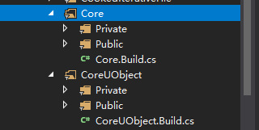
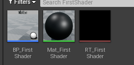
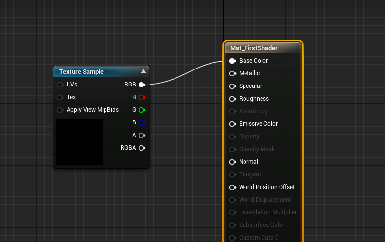
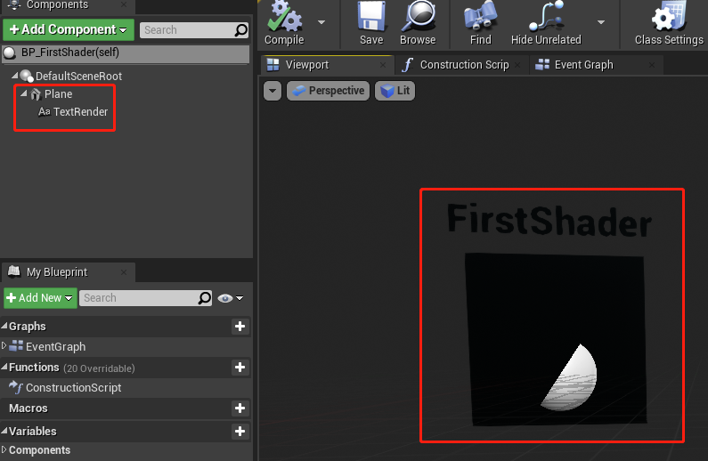
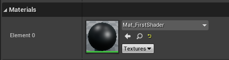
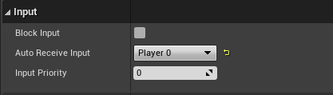
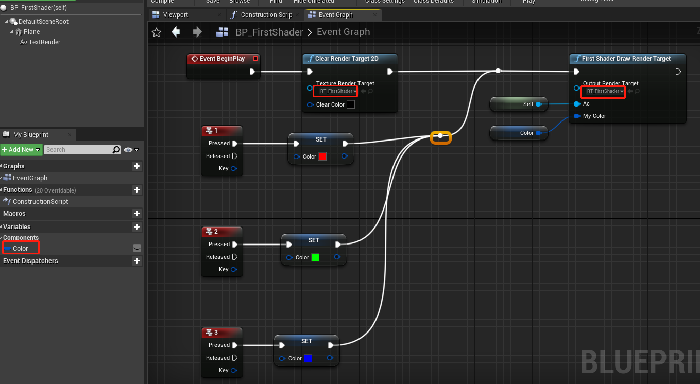

Title: UE4渲染编程01_第一个Shader  
Date: 2020-12-07   
Category: Unreal Engine    
Tags: Shader 渲染  

# UE4渲染编程01_第一个Shader

[TOC]


## 创建一个UE4插件

我们的一些测试性开发可以以UE插件的形式进行，这样方便将我们的代码方便地导入其他工程。下面我们来新建一个插件专门用作Shader开发。

1. 点击菜单栏**Edit -> Plugins**

2. 在弹出框中点击右下方的绿色的**New Plugin** 按钮

3. 选择创建一个空插件，输入插件名（我用的是ShaderTest），不要勾选引擎插件，点**Create Plugin**创建。成功后工程目录下**Plugin/ShaderTest**就是插件的根目录

   

4. 关闭UE4 Editor

5. 更改**ShaderTest/Source/ShaderTest/ShaderTest.Build.cs**中的如下内容：

   ```csharp
   PublicDependencyModuleNames.AddRange(
       new string[]
       {
           "Core",
           "CoreUObject",
           "Engine",
           "RHI",
           "Projects",
           "RenderCore",
       }
   );
   			
   		
   PrivateDependencyModuleNames.AddRange(
       new string[]
       {
           "CoreUObject",
           "Engine",
           "Slate",
           "SlateCore",
       }
   );
   ```

   UE的各种功能都是由**模块**组成，大致结构如下：

   

   C#文件用来描述这个模块的信息，Public存放对外接口，Private存放对内部实现。

   如果在我们的插件中使用了某个函数的定义，却没有在***.Build.cs**中声明对这个模块的依赖，那么在链接的时候就会报**找不到外部符号**的错误。

6. 更改**ShaderTest/Source/ShaderTest/Private/ShaderTest.cpp**

   ```cpp
   #include "ShaderTest.h"
   #include "Interfaces/IPluginManager.h"
   
   void FShaderTestModule::StartupModule()
   {
   	// This code will execute after your module is loaded into memory; the exact timing is specified in the .uplugin file per-module
   	FString PluginShaderDir = FPaths::Combine(IPluginManager::Get().FindPlugin(TEXT("ShaderTest"))->GetBaseDir(), TEXT("Shaders"));
   	AddShaderSourceDirectoryMapping(TEXT("/Plugin/ShaderTest"), PluginShaderDir);
   }
   
   void FShaderTestModule::ShutdownModule()
   {
   	// This function may be called during shutdown to clean up your module.  For modules that support dynamic reloading,
   	// we call this function before unloading the module.
   }
   	
   IMPLEMENT_MODULE(FShaderTestModule, ShaderTest)
   ```

   `AddShaderSourceDirectoryMapping`是将一个**真实**的路径映射到**虚拟**的路径上来，UE内部加载编译Shader使用的都是虚拟路径。具体使用虚拟路径的方式可以参考**ShaderCore.cpp**中的**GetShaderSourceFilePath**函数。

7. 将**ShaderTest.uplugin**中的**LoadingPhase**改为**PostConfigInit**：

   

   这是因为在UE看来，所有的Shader都是一种**预编译资源**， 必须在加载资源前准备妥当。


## 添加Shader文件
1. 在插件根目录下创建**Shaders/Private**目录，并在改目录下创建名为**FirstShader.usf**的文本文件，输入：

```cpp
    #include "/Engine/Public/Platform.ush"

    void MainVS( in float4 InPosition : ATTRIBUTE0, out float4 OutPosition : SV_POSITION)
    {
    OutPosition = InPosition;
    }

    float4 SimpleColor;
    void MainPS( out float4 OutColor : SV_Target0)
    {
    OutColor = SimpleColor;
    }
```
这是一个简单的Shader，功能就是显示外部传入的颜色（SimpleColor）。

## Shader对应的C++类

我们知道Shader是运行在GPU上的小程序，为了能在CPU上操作GPU上的Shader， UE4提供了三种管理Shader的C++类:  `FGlobalShader`, `FMaterialShader`和`FMeshMaterialShader`。其中，GlobalShader全局只存在一份实例，所以它不需要与材质绑定，其他两种需要和材质绑定，每个材质可以有一个实例。我们使用GlobalShader来作为我们的第一个Shader。

1. 在**Source/Private下创建**Common**目录，用来保存一些公用的东西，在该目录下创建**MyGlobalShaderBase.h**

```cpp
#pragma once

#include "GlobalShader.h"

class FMyGlobalShaderBase : public FGlobalShader
{

public:
	FMyGlobalShaderBase();

	FMyGlobalShaderBase(const ShaderMetaType::CompiledShaderInitializerType& Initializer);

    //是否编译着色器排列，具体信息后续章节说明
	static bool ShouldCompilePermutation(const FGlobalShaderPermutationParameters& Parameters);

    //自定义Shader中的环境变量
	static void ModifyCompilationEnvironment(const FGlobalShaderPermutationParameters& Parameters,
		FShaderCompilerEnvironment& OutEnvironment);
};

```

10. 在**Common**目录下创建**MyGlobalShaderBase.cpp**

   ```cpp
   #include "Common/MyGlobalShaderBase.h"
   
   FMyGlobalShaderBase::FMyGlobalShaderBase() {}
   
   FMyGlobalShaderBase::FMyGlobalShaderBase(const ShaderMetaType::CompiledShaderInitializerType& Initializer)
   	: FGlobalShader(Initializer)
   {
   }
   
   bool FMyGlobalShaderBase::ShouldCompilePermutation(const FGlobalShaderPermutationParameters& Parameters)
   { 
   	return true;
   }
   
   void FMyGlobalShaderBase::ModifyCompilationEnvironment(const FGlobalShaderPermutationParameters& Parameters, FShaderCompilerEnvironment& OutEnvironment)
   {
   	FGlobalShader::ModifyCompilationEnvironment(Parameters, OutEnvironment);
   }
   ```


3.  在**Source/Private**下创建**FirstShader**目录, 并在该目录下创建**FirstShader.h**。这个类就是真正操作我们Shader文件的类。

```cpp
#pragma once

#include "Common/MyGlobalShaderBase.h"

//定点着色器，对应于HLSL中的MainVS
class FFirstShaderVS : public FMyGlobalShaderBase
{
    //申明这个类会实例化出一个GlobalShader
	DECLARE_SHADER_TYPE(FFirstShaderVS, Global);

public:
	FFirstShaderVS() {}

	FFirstShaderVS(const ShaderMetaType::CompiledShaderInitializerType& Initializer) : FMyGlobalShaderBase(Initializer){}
};

//像素着色器，对应于HLSL中的MainPS
class FFirstShaderPS : public FMyGlobalShaderBase
{
	DECLARE_SHADER_TYPE(FFirstShaderPS, Global);

private:
    //申明一个对应于Shader中的变量
	LAYOUT_FIELD(FShaderParameter, SimpleColorVal);

public:
	FFirstShaderPS() {}

	FFirstShaderPS(const ShaderMetaType::CompiledShaderInitializerType& Initializer);

    //外部设置SimgleColorVal的接口
	void SetColor(FRHICommandListImmediate& RHICmdList, const FPixelShaderRHIRef ShaderRHI, const FLinearColor& MyColor);
};
```


4. 在**FirstShader**目录下创建**FirstShader.cpp**

```cpp
#include "FirstShader/FirstShader.h"

FFirstShaderPS::FFirstShaderPS(const ShaderMetaType::CompiledShaderInitializerType& Initializer)
	: FMyGlobalShaderBase(Initializer)
{
    //将变量SimpleColorVal绑定到HLSL Shader中的变量SimpleColor
	SimpleColorVal.Bind(Initializer.ParameterMap, TEXT("SimpleColor"));
}

void FFirstShaderPS::SetColor(FRHICommandListImmediate& RHICmdList, const FPixelShaderRHIRef ShaderRHI, const FLinearColor& MyColor)
{
    //设置变量值
	SetShaderValue(RHICmdList, ShaderRHI, SimpleColorVal, MyColor);
}

//将C++定义的顶点着色器和像素着色器和HLSL定义的着色器绑定到一起
IMPLEMENT_SHADER_TYPE(, FFirstShaderVS, TEXT("/Plugin/ShaderTest/Private/FirstShader.usf"), TEXT("MainVS"), SF_Vertex)
IMPLEMENT_SHADER_TYPE(, FFirstShaderPS, TEXT("/Plugin/ShaderTest/Private/FirstShader.usf"), TEXT("MainPS"), SF_Pixel)
```


## Shader对蓝图暴露的接口

1. **Source/Public**下创建**ShaderTestLibrary.h**，它是蓝图使用Shader的接口：

   ```cpp
   #pragma once
   
   /**
   * FisherShader对蓝图的接口 
   */
   
   #include "Engine/TextureRenderTarget2D.h"
   #include "Kismet/BlueprintFunctionLibrary.h"
   #include "ShaderTestLibrary.generated.h"
   
   UCLASS()
   class UShaderTestLibrary : public UBlueprintFunctionLibrary
   {
   	GENERATED_BODY()
   
   public:
       //将Shader的渲染结果输入到OutputRenderTarget， MyColor就是我们要设置的颜色
   	UFUNCTION(BlueprintCallable, Category = "ShaderTestPlugin")
   	static void FirstShaderDrawRenderTarget(UTextureRenderTarget2D* OutputRenderTarget, AActor* Ac, FLinearColor MyColor);
   };
   
   ```

2. 在**ShaderTest/Private**下创建**FirstShader**目录，在该目录下创建**FirstShaderLibrary.cpp**文件，用于实现**10**中结接口：

    ```cpp
    #include "ShaderTestLibrary.h"
    #include "FirstShader/FirstShader.h"
    #include "Common/TestShaderUtils.h"
    
    //渲染线程
    static void FirstShader_RenderThread(
    	FRHICommandListImmediate& RHICmdList,
    	FTextureRenderTargetResource* OutTextureRenderTargetResource,
    	ERHIFeatureLevel::Type FeatureLevel,
    	FName TextureRenderTargetName,
    	FLinearColor MyColor
    )
    {
    	check(IsInRenderingThread());
    
    	FRHITexture2D* RenderTargetTexture = OutTextureRenderTargetResource->GetRenderTargetTexture();
    
        //使用BeginRenderPass和EndRenderPass定义一个Pass
    	FRHIRenderPassInfo RPInfo(RenderTargetTexture, ERenderTargetActions::DontLoad_Store, OutTextureRenderTargetResource->TextureRHI);
    	RHICmdList.BeginRenderPass(RPInfo, TEXT("DrawTestShader"));
    
        //渲染分辨率
    	FIntPoint DrawTargetResolution(OutTextureRenderTargetResource->GetSizeX(), OutTextureRenderTargetResource->GetSizeY());
        
        //视口
    	RHICmdList.SetViewport(0, 0, 0.0f, DrawTargetResolution.X, DrawTargetResolution.Y, 1.0f);
    
        //拿到我们定义的Global Shader
    	FGlobalShaderMap* GlobalShaderMap = GetGlobalShaderMap(FeatureLevel);
    	TShaderMapRef<FFirstShaderVS> VertexShader(GlobalShaderMap);
    	TShaderMapRef<FFirstShaderPS> PixelShader(GlobalShaderMap);
    
    	//设置渲染管线的一些参数
    	FGraphicsPipelineStateInitializer GraphicsPSOInit;
    	RHICmdList.ApplyCachedRenderTargets(GraphicsPSOInit);
    	GraphicsPSOInit.DepthStencilState = TStaticDepthStencilState<false, CF_Always>::GetRHI();
    	GraphicsPSOInit.BlendState = TStaticBlendState<>::GetRHI();
    	GraphicsPSOInit.RasterizerState = TStaticRasterizerState<>::GetRHI();
    	GraphicsPSOInit.PrimitiveType = PT_TriangleList; //画三角形
    	GraphicsPSOInit.BoundShaderState.VertexDeclarationRHI = GetVertexDeclarationFVector4();
        //我们自定义的shader
    	GraphicsPSOInit.BoundShaderState.VertexShaderRHI = VertexShader.GetVertexShader();
    	GraphicsPSOInit.BoundShaderState.PixelShaderRHI = PixelShader.GetPixelShader();
    	SetGraphicsPipelineState(RHICmdList, GraphicsPSOInit);
    	//设置自定义的参数
    	PixelShader->SetColor(RHICmdList, PixelShader.GetPixelShader(), MyColor);
    
    	//构造顶点数据
    	TArray<FVector4> VertexList;
    	VertexList.Add(FVector4(-1.0f, 1.0f, 0, 1.0f));
    	VertexList.Add(FVector4(1.0f, 1.0f, 0, 1.0f));
    	VertexList.Add(FVector4(-1.0f, -1.0f, 0, 1.0f));
    	VertexList.Add(FVector4(1.0f, -1.0f, 0, 1.0f));
    
    	FRHIResourceCreateInfo CreateInfo;
    	FVertexBufferRHIRef VertexBufferRHI = RHICreateVertexBuffer(sizeof(FVector4) * VertexList.Num(), BUF_Volatile, CreateInfo);
    	void* VoidPtr = RHILockVertexBuffer(VertexBufferRHI, 0, sizeof(FVector4) * VertexList.Num(), RLM_WriteOnly);
    
    	FVector4* Vertices = (FVector4*)VoidPtr;
    
    	for (int i = 0; i < VertexList.Num(); i++)
    	{
    		Vertices[i] = VertexList[i];
    	}
    	RHIUnlockVertexBuffer(VertexBufferRHI);
    
    	//构造顶点索引
    	const uint16 Indices[] = { 0, 1, 2, 2, 1, 3 };
    	TResourceArray<uint16, INDEXBUFFER_ALIGNMENT> IndexBuffer;
    
    	IndexBuffer.AddUninitialized(6);
    	FMemory::Memcpy(IndexBuffer.GetData(), Indices, 6 * sizeof(uint16));
    
    	// Create index buffer. Fill buffer with initial data upon creation
    	FRHIResourceCreateInfo CreateInfo(&IndexBuffer);
    	FIndexBufferRHIRef IndexBufferRHI = RHICreateIndexBuffer(sizeof(uint16), IndexBuffer.GetResourceDataSize(), BUF_Static, CreateInfo);
    	
    	//根据顶点数据和索引数据画三角形
    	RHICmdList.SetStreamSource(0, VertexBufferRHI, 0);
    	RHICmdList.DrawIndexedPrimitive(IndexBufferRHI, 0, 0, 4, 0, 2, 1);
    
    	RHICmdList.EndRenderPass();
    }
    
    
    void UShaderTestLibrary::FirstShaderDrawRenderTarget(UTextureRenderTarget2D* OutputRenderTarget, AActor* Ac, FLinearColor MyColor)
    {
    	check(IsInGameThread());
    
    	if (!OutputRenderTarget)
    	{
    		return;
    	}
    
        //设置一些参数，并将渲染线程函数加入渲染task列表
    	FTextureRenderTargetResource* TextureRenderTargetResource = OutputRenderTarget->GameThread_GetRenderTargetResource();
    	UWorld* World = Ac->GetWorld();
    	ERHIFeatureLevel::Type FeatureLevel = World->Scene->GetFeatureLevel();
    	FName TextureRenderTargetName = OutputRenderTarget->GetFName();
    	ENQUEUE_RENDER_COMMAND(CaptureCommand)(
    		[TextureRenderTargetResource, FeatureLevel, MyColor, TextureRenderTargetName](FRHICommandListImmediate& RHICmdList)
    		{
    			FirstShader_RenderThread(RHICmdList, TextureRenderTargetResource, FeatureLevel, TextureRenderTargetName, MyColor);
    		}
    	);
    }
    ```

## 使用

1. 在编辑器中创建三个资源，分别为Actor, Material, RenderTarget2D

    

2. 打开**Mat_FirstShader**, 将RT_FirstShader拖进去，然后连线

    

3. 打开**BP_FirstShader**， 创建一个Plane和TextRender

    

    将**Plane**的材质设为**Mat_FirstShader**

    

    打开**BP_ShaderTest**的输入：

    

    在EventGraph中加入如下逻辑：

    
4. 将**BP_FirstShader**拖入场景中，运行，可以看到面板的颜色随着按键123而切换。
