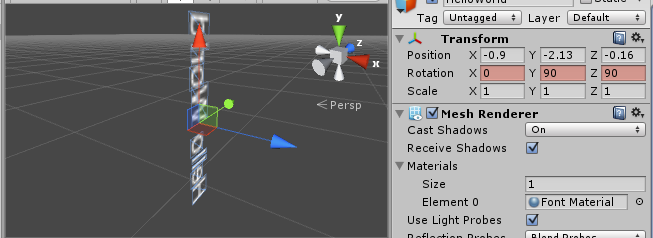

Title: 计算机图形数学中矩阵学习笔记
Date: 2016-02-02
Category: 计算机图像
Tags: 计算机图像

#计算机图形数学基础学习笔记

在游戏编程过程中，如果要操作一个物体，我们会使用各种矩阵。下面来说一下这些矩阵是如何起作用的。

##矩阵与坐标变换

在图像的绘制过程中，矩阵主要是用来进行坐标变换。我们先来看下面的推导。
		
- 要得到任意**坐标系1**中的某个点[a, b, c]，可以让原点先在x轴位移[a, 0, 0], 再在y轴上位移[0, b, 0]，最后在z轴上位移[0, 0, c]。将这三个方向的单位向量定义为$p,q,r$, 可以得到推导中的(1)。
- p,q,r是**坐标系2**中的某个向量，如推导中的(2)
- 计算后得到推导结果(4)，该结果就是**坐标系1**中的向量[a, b, c]在**坐标系2**中的表示

从最终的结果可以看出，将一个**坐标系1**中的向量变换到**坐标系2**中，只需要**右乘一个矩阵**即可。再看这个矩阵的内容，我们发现它的每一行就是**坐标系1**中的坐标轴方向的**单位向量**在**坐标系2**中的表示。

在二维笛卡尔坐标系下来看一下实例：

对于**物体坐标系**，它的坐标轴的单位向量在**世界坐标系**中分别为：p=[2, 1], q=[-1, 2]：

那么对于物体坐标系中的某个点[1, 1]，变换到世界坐标系中为：

我们发现，从**物体坐标系**到**世界坐标系**的变换，是**物体坐标系**进行了**缩小**，和**顺时针旋转**， 但对于绘制出来的图像对于**世界坐标系**却是**放大**和**逆时针旋转**。在计算机绘制图形的时候，就是通过变换坐标系来进行图像的**缩放**和**旋转**的。

##矩阵变换的应用

计算时，可以通过预先得出的变换矩阵来使流程简化。下面列一下各种变换矩阵。

###缩放
二维与三维的缩放矩阵：

其中n为缩放方向，k为缩放因子。

###旋转
二维坐标系中的绕圆心旋转和三维坐标系中绕某个向量旋转

###正交投影
投影其实就是缩放。向某个平面投影，就是物体在该平面的法向量上的缩放为0。

###镜像
镜像也是缩放。物体对于某个平面的镜像，就是该物品在平面法向量上的缩放为-1。例如在Unity2D中，如果将某个精灵的轴的缩放设为-1，那么会得到一个镜像精灵。

###平移与齐次坐标

从上面的内容可知，将某一个向量平移，可以加上一个矩阵；将一个物体缩放或旋转，可以右乘一个矩阵：	

其中M1是缩放旋转矩阵，M2是位移矩阵。如果经过多次这样的变换的话，会产生很多的代数项，齐次坐标就是用来解决这个问题的。

所谓齐次坐标就是用n+1个分量来表示n维坐标。例如：二维平面上的点$A(x , y)$用齐次坐标表示为$(h_x , h_y , h)$；三维空间中的点$B(x , y , z)$用齐次坐标表示为$(h_x , h_y , h_z , h)$。一个向量的齐次表示并不是唯一的，齐次坐标中的h取不同值表示的都是同一个点，比如(8 , 4 , 2)、(4 , 2 , 1)表示的都是二维平面上的点(4 , 2)。下面来看一个等式：

可以看出，一个点的位移，可以用齐次坐标的右乘来表示。

##矩阵的缺点

- 不直观
- 数据冗余
- 大量矩阵相乘容易产生坏数据

##欧拉角
在三维坐标系中，要转动某个物体，可以通过依次绕其各个轴旋转来实现。那么表示一个物体的方位，就可以通过这三个角来表示。
欧拉角表示的是物体的最终方位而不是旋转过程。例如我们说将一个物体旋转到(ψ, θ, φ)，这个方位是相对于物体**未旋转**时的角度，而**不是**将当前物体绕z轴旋转ψ， 绕x轴旋转θ， 绕y轴旋转φ。

###万向节运动
因为用欧拉角表示方位与旋转的次序无关。unity中默认的是z-x-y，这样的次序就导致了z轴的旋转会影响x,y轴的旋转，x轴的旋转会影响y轴的旋转。 这样的旋转类似于万向节的运动。

###万向锁

假设物体按heading-pitch-bank的方式旋转，例如在下面的[示例][1]中，绿色圈代表y轴的旋转，红色圈代表x轴的旋转，蓝色轴代表z轴的旋转。初始状态如下图：

当绕x轴旋转90度时，发现此时的z轴和以前y轴重合了。

这就意味着，最开始的y轴旋转和此时的z轴旋转是等效的，z轴的旋转可以通过y轴的旋转来实现，可以被认为是无效的。那么欧拉角就损失了一个维度。例如在Unity 3D中：

方位一致

###插值计算

欧拉角对计算物体旋转差值产生影响。以Unity3D为例。

假如一个物体的初始方位为（90， 0， 0），

要旋转到（0， 90， 90）

直观上看，就是将HelloWord立起来。但却有三个坐标轴做了旋转，通过分析其中的插值可以看到，它运动的路径和我们期望的路径并不一样。

计算错误的原因：因为是以万向节的形式旋转，物体旋转到某个位置，有可能需要同时旋转两个或三个坐标轴。此时真正的球面差值和欧拉角的差值不同。旋转依赖的参数太多。

##复数与旋转

要解决差值问题，还是要减少旋转依赖的参数。但矩阵的数据太冗余，好在数学家们发现如下规律：
对于复数：

$ p = x + yi $
$ q = cosθ + i sinθ$
$ pq = (x + yi)(cosθ + isinθ) = (xcosθ - ysinθ) + (xsinθ+ ycosθ)i $

这对于上面的旋转矩阵是不是很像？只要将复数的实部和虚部看做坐标轴，那么*p*可以看做一个向量，pq就可以看p成旋转θ角之后的向量。

###四元数

相对于二维坐标中的复数，数学家还定义了三维坐标中的四元数：

$p = w + xi + yj + zk$

其中：

$i^2 = j^2 = k^2 = -1$
$ij = k, ji = -k$
$jk = i, kj = -i$
$ki = j, ik = -j$

设四元数：

$ q = [cos(\theta /2),  nsin(\theta/2)] = [cos(\theta/2), ({n}_{x}sin(\theta/2), {n}_{y}sin(\theta/2), {n}_{z}sin(\theta/2))] $

对于任意四元数：

$ p = [w, (x, y, z)] $

那么对于等式：

$ p' = qpq^{-1} = [cos(\theta /2),  nsin(\theta/2)][w, (x, y, z)][cos(\theta /2),  -nsin(\theta/2)]$

展开后可以得到类似于三维旋转矩阵的东西。这说明四元数可以用在物体的旋转计算中。

[1]:  http://v.youku.com/v_show/id_XNzkyOTIyMTI=.html

