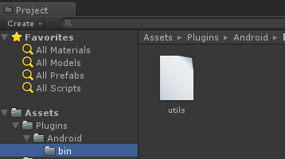
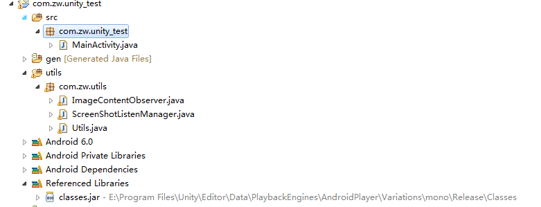
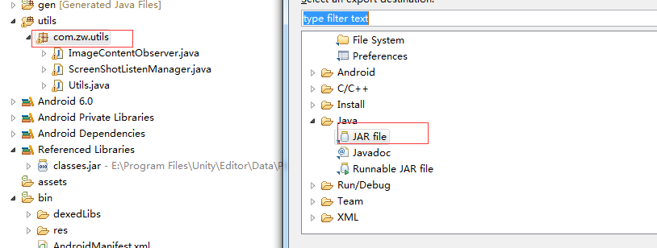
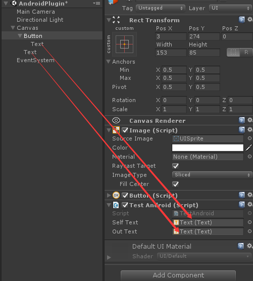

Title: Unity下C#与Java的交互
Date: 2017-10-27
Category: 编程语言
Tags: Unity


#Unity下C#与Java的交互(一)


这种情况主要发生在Unity要使用Android代码的情况下。Unity提供的方式是将用到的Android代码打成jar文件，放到Unity的plugins文件中，然后使用

示例用到的是utils.jar


##1. 创建Android工程
创建一个Android工程，并导入Unity提供的jar，下面是我的示例：


其中，`com.zw.utils`是要导出的包，`com.zw.unity_test`是我用来测试jar包的代码，class.jar是导入的unity提供的jar包。

##2. 编写java代码并导出
这里先实现一个小功能：

```java
public class Utils {
	public static int addOne(int a){
    	return a+1;
    }
}
```
右击`com.zw.utils`导出jar：


并将utils.jar放到Unity的 **Asset/Plugins/Android/bin** 目录下

##3. 编写C#代码

```java
public class TestAndroid : MonoBehaviour {

    private Button selfBtn;
    public Text selfText;
    public Text outText;
    private int a = 0;

	// Use this for initialization
	void Start ()
    {
        selfBtn = gameObject.GetComponent<Button>();
        selfBtn.onClick.AddListener(onSelfBtnClick);
    }

    private void onSelfBtnClick()
    {
        try
        {
#if UNITY_ANDROID
            AndroidJavaClass jClass = new AndroidJavaClass("com.zw.utils.Utils");
            a = jClass.CallStatic<int>("addOne", a);
#endif
            selfText.text = "" + a;
        }
        catch(Exception e)
        {
            outText.text = e.ToString();
        }
    }
}
```
Unity界面

button上的text显示java代码返回的结果，另一个text显示错误信息。

##打Android包运行

略


