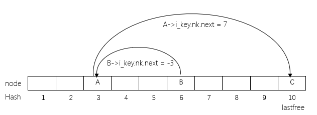
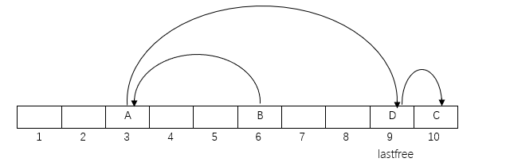
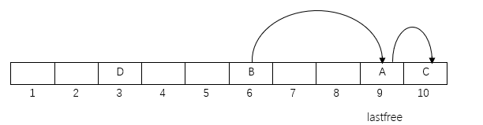

Title:lua源码阅读3——table  
Date: 2019-03-19  
Category: lua源码阅读


[TOC]

​     

## Table结构体

```c
typedef struct Table {
	CommonHeader;
	lu_byte flags;  /* 1<<p means tagmethod(p) is not present */
	lu_byte lsizenode;  /* log2 of size of 'node' array 例如5标识node数组大小为32 */
	unsigned int sizearray;  /* size of 'array' array 数组部分的大小*/
	TValue *array;  /* array part */
	Node *node;   //哈希部分，也是一片连续内存

	//例如初始有16个node， 那么lasfree=node+16
	Node *lastfree;  /*any free position is before this position*/
	struct Table *metatable;
	GCObject *gclist;
} Table;
```

### 节点的结构

```c
typedef struct Node {
  TValue i_val;
  TKey i_key;  
} Node;
```

一个节点包含一个key和value。我们主要来看看TKey:

```c
typedef union TKey {
  struct {
    TValuefields;
    //当前版本已经不使用链表来保存数据了，分配一片连续的内存，推测是为了加快访问速度
    int next;  /* for chaining (offset for next node) */
  } nk; //代表着一个链表
  TValue tvk; //代表着一个值
} TKey;
```

### 结构图


### table的大小

```c
/*
** Try to find a boundary in table 't'. A 'boundary' is an integer index
** such that t[i] is non-nil and t[i+1] is nil (and 0 if t[1] is nil).
*/
lua_Unsigned luaH_getn (Table *t) {
  unsigned int j = t->sizearray;
  if (j > 0 && ttisnil(&t->array[j - 1])) {
    /* there is a boundary in the array part: (binary) search for it */
    unsigned int i = 0;

	//二分查找最后一个不是nil的value，i=value其下标+1，也就是个数
    while (j - i > 1) {
      unsigned int m = (i+j)/2;
      //保证j-1始终为nil, 如果数组全为nil，最终j=1, i=0
      if (ttisnil(&t->array[m - 1])) j = m; 
      else i = m; //如果移动过i，i-1始终不为nil
    }
    return i;
  }
  /* else must find a boundary in hash part */
  else if (isdummy(t))  /* hash part is empty? */
    return j;  /* that is easy... */
  else return unbound_search(t, j);
}
```

这个函数用来获取table中的数组大小，用在tabe的`#`运算上。我们注意到，它是通过二分查找来找的，就会导致一个有趣的现象：

```lua
#{0, 1, 2, 3, 4, 5, nil} == 6
#{0, 1, 2, nil, 4, 5, nil} == 6
#{0, 1, nil, 3, 4, 5, nil} == 2
```

因为二分法的步长把3号位的nil跳过去了。

当最后一个元素不是nil时，使用的是`unbound_search`来获取大小，它的本质还是一个二分查找：

```c
static lua_Unsigned unbound_search (Table *t, lua_Unsigned j) {
  lua_Unsigned i = j;  /* i is zero or a present index */
  j++;

  //以2的幂次方为步长，找到一个为nil的下标
  /* find 'i' and 'j' such that i is present and j is not */
  while (!ttisnil(luaH_getint(t, j))) {
    i = j;
    if (j > l_castS2U(LUA_MAXINTEGER) / 2) {  /* overflow? */
      /* table was built with bad purposes: resort to linear search */
      i = 1;
      while (!ttisnil(luaH_getint(t, i))) i++;
      return i - 1;
    }
    j *= 2;
  }
  //在i和i*2的区间进行二分查找
  /* now do a binary search between them */
  while (j - i > 1) {
    lua_Unsigned m = (i+j)/2;
    if (ttisnil(luaH_getint(t, m))) j = m;
    else i = m;
  }
  return i;
}
```

通过这部分源代码我们可以看出来，lua认为nil为一个数组的结尾，为了不出现意外的情况，我们在建立数组时，**数组里面的值最好不要有nil**。

## 创建

### 创建table

```c
Table *luaH_new (lua_State *L) {
  GCObject *o = luaC_newobj(L, LUA_TTABLE, sizeof(Table));
  Table *t = gco2t(o);
  t->metatable = NULL;
  t->flags = cast_byte(~0); //flag初始化应该为255， 
  t->array = NULL;
  t->sizearray = 0;
  setnodevector(L, t, 0);
  return t;
}
```

### 创建key

```c
/* 新建一个key，范围该key的value
** 主要用在添加非数组的值上。因为数组的key就是其下标
** inserts a new key into a hash table; first, check whether key's main
** position is free. If not, check whether colliding node is in its main
** position or not: if it is not, move colliding node to an empty place and
** put new key in its main position; otherwise (colliding node is in its main
** position), new key goes to an empty position.
*/
TValue *luaH_newkey (lua_State *L, Table *t, const TValue *key) {
  Node *mp;
  TValue aux;

  //key不能是nil
  if (ttisnil(key)) luaG_runerror(L, "table index is nil");

  //检查key是否为nil, 并看能不能将float的key转成int的key
  else if (ttisfloat(key)) {
    lua_Integer k;
    if (luaV_tointeger(key, &k, 0)) {  /* does index fit in an integer? */
      setivalue(&aux, k);
      key = &aux;  /* insert it as an integer */
    }
    else if (luai_numisnan(fltvalue(key)))
      luaG_runerror(L, "table index is NaN");
  }

  //根据key的哈希值得到它应该在的节点
  mp = mainposition(t, key);

  //mp的value有值，或者表就是空的，需要创建新的节点
  if (!ttisnil(gval(mp)) || isdummy(t)) {  /* main position is taken? */
    Node *othern;
    Node *f = getfreepos(t);  /* get a free place */
    if (f == NULL) {  /* cannot find a free place? */
      rehash(L, t, key);  /* grow table */
      /* whatever called 'newkey' takes care of TM cache */
      return luaH_set(L, t, key);  /* insert key into grown table */
    }
    lua_assert(!isdummy(t));
    othern = mainposition(t, gkey(mp));

	//mp处的node的key得到的索引和node的下标不匹配
	//说明该node不是通过hash放进去的，它应该是和othern具有相同索引的节点
	//通过lastfree放进去的
    if (othern != mp) {  /* is colliding node out of its main position? */
      /* yes; move colliding node into free position */
	  //找到具有相同hash的第一个节点
      while (othern + gnext(othern) != mp)  /* find previous */
        othern += gnext(othern);
	  //把mp处的节点放到lastfree的位置
      gnext(othern) = cast_int(f - othern);  /* rechain to point to 'f' */
      *f = *mp;  /* copy colliding node into free pos. (mp->next also goes) */
      if (gnext(mp) != 0) {
        gnext(f) += cast_int(mp - f);  /* correct 'next' */
        gnext(mp) = 0;  /* now 'mp' is free */
      }
      setnilvalue(gval(mp));
    }
    else {  /* colliding node is in its own main position */
      /* new node will go into free position */
      if (gnext(mp) != 0)
        gnext(f) = cast_int((mp + gnext(mp)) - f);  /* chain new position */
      else lua_assert(gnext(f) == 0);
      gnext(mp) = cast_int(f - mp);
      mp = f;
    }
  }
  //在mp的节点设key， 返回value
  setnodekey(L, &mp->i_key, key); //key的值
  luaC_barrierback(L, t, key);
  lua_assert(ttisnil(gval(mp)));
  return gval(mp); //返回key对应的value
}
```

用图表来说明下这个过程，例如一个表的初始状态如下:



有A, B, C 三个Node， 他们的hash值都6，通过next串联起来。现在需要创建一个节点D

1.  D的key的hash值指向一个空Node， 直接写进去

2.  D的key的hash值指向一个非空Node，假设为A， 有两种情况

    - D和A的hash值相同

      

    - D和A的hash值不同

      

### 扩展大小

```cpp
static void rehash (lua_State *L, Table *t, const TValue *ek) {
  unsigned int asize;  /* optimal size for array part */
  unsigned int na;  /* number of keys in the array part */

  //位图, 主要用来记录表中元素分布位置
  //如果位于key的值不为nil，那么位图中num[ceil(log2(key))]中的值+1
  //例如：key=8的值不为nil， num[3]++
  unsigned int nums[MAXABITS + 1];
  int i;
  int totaluse;
  for (i = 0; i <= MAXABITS; i++) nums[i] = 0;  /* reset counts */

  //将数组中的信息填入位图，na为数组中元素的个数
  na = numusearray(t, nums);  /* count keys in array part */
  totaluse = na;  /* all those keys are integer keys */

  //将哈希表中的信息填入位图
  totaluse += numusehash(t, nums, &na);  /* count keys in hash part */

  /* count extra key */
  na += countint(ek, nums); //要加进去的key
  totaluse++;
  /* compute new size for array part */
  asize = computesizes(nums, &na);

  /* resize the table to new computed sizes */
  luaH_resize(L, t, asize, totaluse - na);
}

```

简要来说：

1. 对于key为数字部分，将其分布写入位图，当空间利用率大于50%的时候，扩展。
2. 对于hash部分，找不到空闲节点了就需要扩展了。


## 查

### 主入口

```c
/*
** main search function
*/
const TValue *luaH_get (Table *t, const TValue *key) {
  //根据key的类型调用不同的函数来查找
  switch (ttype(key)) {
    case LUA_TSHRSTR: return luaH_getshortstr(t, tsvalue(key));
    case LUA_TNUMINT: return luaH_getint(t, ivalue(key));
    case LUA_TNIL: return luaO_nilobject;
    case LUA_TNUMFLT: {
      lua_Integer k;
	  //将float的key转成int，如果floor(key) != int(key),则进入defaut
      if (luaV_tointeger(key, &k, 0)) /* index is int? */
        return luaH_getint(t, k);  /* use specialized version */
      /* else... */
    }  /* FALLTHROUGH */
    default: //通用查找
      return getgeneric(t, key);
  }
}
```

在这里我们看到一个比较有趣的地方，即在lua中，肯定有`t[2.0] == t[2]`,  由于各机器上`double`是有精度限制的，如果`10 == 10.0000000000000001`， 那么`t[10] == t[10.0000000000000001]`。

### 查找key为短字符串的值

```c
/*
** search function for short strings
*/
const TValue *luaH_getshortstr (Table *t, TString *key) {
  Node *n = hashstr(t, key); //根据短字符串的哈希值找到桶
  lua_assert(key->tt == LUA_TSHRSTR);
  for (;;) {  /* check whether 'key' is somewhere in the chain */
    const TValue *k = gkey(n);
    if (ttisshrstring(k) && eqshrstr(tsvalue(k), key))
      return gval(n);  /* that's it */
    else {
      int nx = gnext(n);
      if (nx == 0)
        return luaO_nilobject;  /* not found */
      n += nx;
    }
  }
}
```

