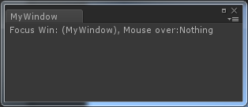

Title: Unity Editor 自定义窗口
Date: 2017-11-22
Category: 计算机图形学
Tags: 学习笔记, Unity, shader

[TOC]

Unity 提供`EditorWindow`给开发者使得开发者可以创建自定义的编辑器界面，像这样的：



下面来深入了解一下。

## 示例代码
```cpp
public class MyWindow : EditorWindow {

	[MenuItem("Window/MyWindow")]
    static void myWindow() //创建自定义窗口
    {
        MyWindow window = (MyWindow)EditorWindow.GetWindow(typeof(MyWindow));
        window.Show();
    }

    private void OnGUI() //构建界面
    {
        string focuseName = focusedWindow == null ? "Nothing" : focusedWindow.ToString();
        string overName = mouseOverWindow == null ? "Nothing" : mouseOverWindow.ToString();
        GUILayout.Label("Focus Win:" + focuseName + ", Mouse over:" + overName);
    }

    void OnInspectorUpdate() //实时更新
    {
        this.Repaint();
    }
}
```
##API解析
### [GetWindow][1]

函数原型：

```cpp
public static EditorWindow GetWindow(Type t, bool utility = false, string title = null, bool focus = true);
```

这个函数的作用是返回当前Uinty界面上的第一个类型为`t`的窗口，如果没有，创建并返回。

参数utility如果为true，那么这个窗口始终是一个浮动窗口，不会和其他窗口组合。

###[OnGUI()][2]

自定义窗口的UI实现

###[focusedWindow][4]和[mouseOverWindow][3]

这是EditorWindow中的两个自定义变量：

```
public static EditorWindow mouseOverWindow;
public static EditorWindow focusedWindow;
```
表示当前Unity界面中，焦点窗口和鼠标Over窗口，可为Null。

###[OnInspectorUpdate()][5]

这个函数每秒会被调用10次，用来实时更新自定义窗口的信息。

在我们的示例程序中，因为要实时监听鼠标的Over事件和窗口的focus事件，所以需要这个函数。

###[Repaint][6]
重新绘制窗口


[1]:https://docs.unity3d.com/ScriptReference/EditorWindow.GetWindow.html
[2]:https://docs.unity3d.com/ScriptReference/EditorWindow.OnGUI.html
[3]:https://docs.unity3d.com/ScriptReference/EditorWindow-mouseOverWindow.html
[4]:https://docs.unity3d.com/ScriptReference/EditorWindow-focusedWindow.html
[5]:https://docs.unity3d.com/ScriptReference/EditorWindow.OnInspectorUpdate.html
[6]:https://docs.unity3d.com/ScriptReference/EditorWindow.Repaint.html

