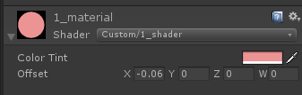
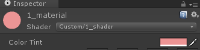

Title: Unity Shader 学习笔记1 —— 第一个Shader
Date: 2017-10-25
Category: 计算机图形学
Tags: 学习笔记, Unity, shader

#Unity Shader 学习笔记1—— 第一个Shader
@(计算机图形学)[学习笔记, Unity, shader]

[TOC]

## Shader结构


###Properties


示例：
```
Properties{
	_Color("Color Tint", Color) = (1.0, 1.0, 1.0, 1.0)
	_Offset("Offset", Vector) = (0, 0, 0, 0)
}
```
类似于定义变量。例如_Color一行的含义为：Shader中有个```_Color```的变量，它的类型是```Color```, 值由编辑器中的**Color Tint**来编辑。效果：


###SubShader 和 Fallback
SubShader是Unity Shader用来支持不同显卡的方式。当Unity加载一个Shader时，会从这个Shader中选取第一个可以支持的SubShader加载，如果都不支持，使用FallBack指定的Shader

SubShader中每个渲染流程可以用Pass包起来，一个SubShader中可以有多个渲染流程

###一个示例
```
Shader "Custom/1_shader" {

	Properties{
		_Color("Color Tint", Color) = (1.0, 1.0, 1.0, 1.0)
		_Offset("Offset", Vector) = (0, 0, 0, 0)
	}

	SubShader{
		Pass {
			CGPROGRAM

			//定义顶点着色器和片元着色器的代码
			#pragma vertex vert
			#pragma fragment frag

			fixed4 _Color;
			fixed4 _Offset;

			float4 vert(float4 v : POSITION) : SV_POSITION {
				//意思是将模型空间中的点转换为剪裁空间（屏幕）中的点，然后加上offset
				return UnityObjectToClipPos(v) + _Offset;
			}

			fixed4 frag() : SV_Target {
				return _Color;
			}

			ENDCG
		}
	}
}
```
###使用
1. **创建shader文件**
在Unity Project中右击，选择`Create->Shader->Standard Surface Shader`，创建完成后改名，然后将自己的代码替换掉原来的代码。

2. **创建Meterial**
创建后，将Shader设为自己的Shader


3. **MeshRender使用**
创建一个GameObject, 增加MeshRender组件，将材质设为刚才创建的材质，就可以看到效果了


