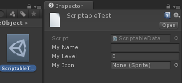

Title: 使用ScriptableObject序列化Unity Object
Date: 2017-11-29
Category: Unity
Tags: 学习笔记, Unity, shader


在Unity中，Unity Object的序列化必须依赖GameObject。像这样是不行的：
```cpp
[Serializable]
class ObjectSheetData : SheetData
{
    public Object data = null;
}

ObjectSheetData objData = new ObjectSheetData();
objData.data = 某个Sprite;

//序列化到data.byte
BinaryFormatter formatter = new BinaryFormatter();
Stream stream = new FileStream("data.byte", FileMode.Create, FileAccess.Write, FileShare.None);

formatter.Serialize(stream, objData);
stream.Close();
```
Unity会提示
>SerializationException: Type UnityEngine.Sprite is not marked as Serializable.

通常的做法是将要序列化的数据附加到一个GameObject上，然后将GameObject做成Prefab，在要使用数据的地方引用Prefab就可以了。这里提供一个算是比较通用的[脚本][1]，用来实现类似表的功能。 但我们发现这是一种<font color=red>**数据附加到界面上来存储**</font>的方式，有违**界面与数据分离**的设计方式。


[**ScriptableObject**][2]提供了一种不依赖**GameObject**的序列化数据的方式。

我们可以将数据封装成这样：

```
public class ScriptableData : ScriptableObject
{
    public string myName = "";
    public int myLevel = 0;
    public Sprite myIcon = null;
}
```

提供一个创建数据文件的接口：

```
[MenuItem("ScriptableTest/CreateData")]
public static void CallFunc()
{
    ScriptableData data = ScriptableObject.CreateInstance<ScriptableData>();
    data.myName = "";
    data.myLevel = 0;
    data.myIcon = null;

    //ScriptableDataPaht是数据文件的路径
    AssetDatabase.CreateAsset(data, GlobalValue.ScriptableDataPaht);
    AssetDatabase.SaveAssets();
}
```
创建出来的文件是这样子的：



填上数据后，就可以在运行时读取了：

```
ScriptableData _data = AssetDatabase.LoadAssetAtPath<ScriptableData>(GlobalValue.ScriptableDataPaht);
nameInput.text = _data.myName;
levelInput.text = _data.myLevel.ToString();
image.sprite = _data.myIcon;
```

[1]:https://github.com/shazi129/tools/blob/master/Unity/IdObjectMap.cs
[2]:https://docs.unity3d.com/ScriptReference/ScriptableObject.html

