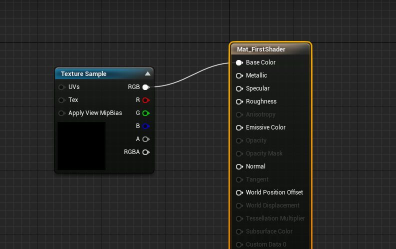
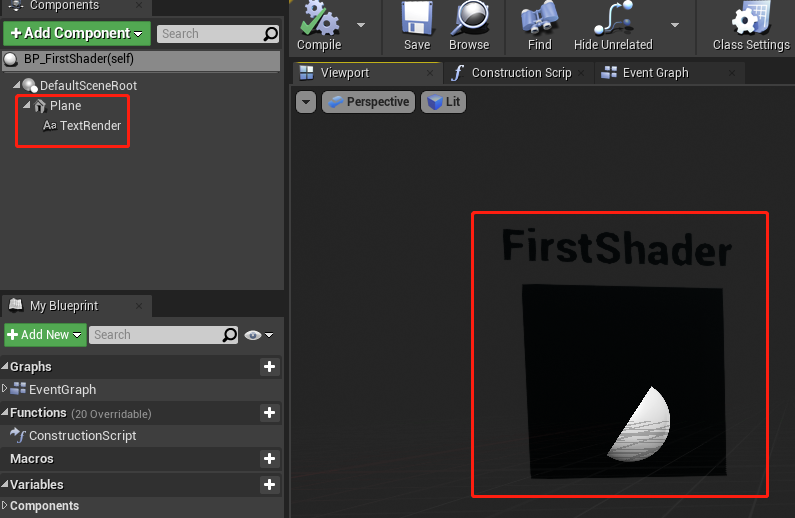
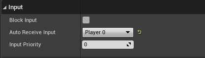
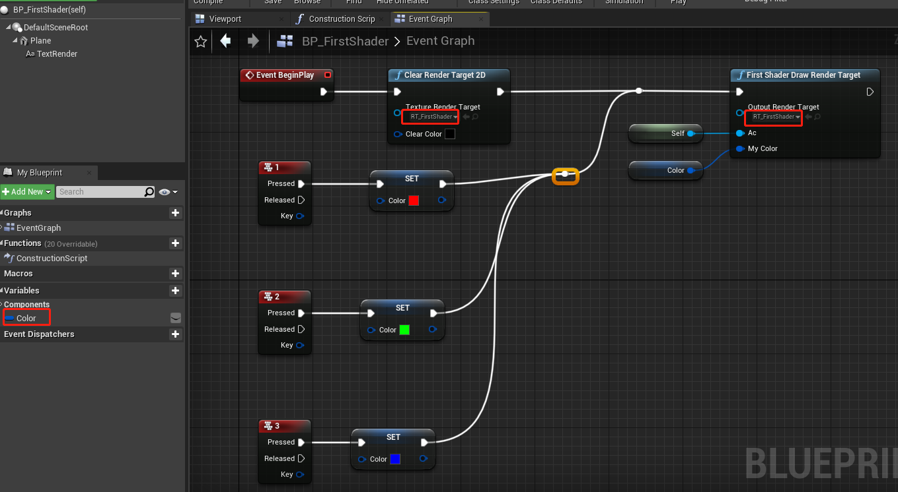

# 第一个Shader

[TOC]


## 创建一个UE4插件

1. 点击菜单栏**Edit -> Plugins**

2. 在弹出框中点击右下方的绿色的**New Plugin** 按钮

3. 选择创建一个空插件，输入插件名（我用的是ShaderTest），不要勾选引擎插件，点**Create Plugin**创建。成功后工程目录下**Plugin/ShaderTest**就是插件的根目录

   

4. 关闭UE4 Editor

5. 在插件根目录下创建**Shaders/Private**目录，并在改目录下创建名为**FirstShader.usf**的文本文件，输入：

   ```cpp
   #include "/Engine/Public/Platform.ush"
   
   void MainVS( in float4 InPosition : ATTRIBUTE0, out float4 OutPosition : SV_POSITION)
   {
       OutPosition = InPosition;
   }
   
   float4 SimpleColor;
   void MainPS( out float4 OutColor : SV_Target0)
   {
       OutColor = SimpleColor;
   }
   ```
   
6. 在**Source/Public**下创建**Common**目录，用来保存一些公用的东西，在该目录下创建**MyGlobalShaderBase.h**

   ```cpp
   #pragma once
   
   #include "GlobalShader.h"
   
   class FMyGlobalShaderBase : public FGlobalShader
   {
   
   public:
   	FMyGlobalShaderBase();
   
   	FMyGlobalShaderBase(const ShaderMetaType::CompiledShaderInitializerType& Initializer);
   
   	static bool ShouldCache(EShaderPlatform Platform);
   
   	static bool ShouldCompilePermutation(const FGlobalShaderPermutationParameters& Parameters);
   
   	static void ModifyCompilationEnvironment(const FGlobalShaderPermutationParameters& Parameters,
   		FShaderCompilerEnvironment& OutEnvironment);
   };
   
   ```

7. 在**Source/Private**下创建**Common**目录，并创建**MyGlobalShaderBase.cpp**

   ```cpp
   #include "Common/MyGlobalShaderBase.h"
   
   FMyGlobalShaderBase::FMyGlobalShaderBase() {}
   
   FMyGlobalShaderBase::FMyGlobalShaderBase(const ShaderMetaType::CompiledShaderInitializerType& Initializer)
   	: FGlobalShader(Initializer)
   {
   }
   
   bool FMyGlobalShaderBase::ShouldCache(EShaderPlatform Platform)
   {
   	return true;
   }
   
   bool FMyGlobalShaderBase::ShouldCompilePermutation(const FGlobalShaderPermutationParameters& Parameters)
   { 
   	return true;
   }
   
   void FMyGlobalShaderBase::ModifyCompilationEnvironment(const FGlobalShaderPermutationParameters& Parameters, FShaderCompilerEnvironment& OutEnvironment)
   {
   	FGlobalShader::ModifyCompilationEnvironment(Parameters, OutEnvironment);
   }
   ```

   

8. 在**Source/Public**下创建**FirstShader**目录, 并在该目录下创建**FirstShader.h**

   ```cpp
   #pragma once
   
   #include "Common/MyGlobalShaderBase.h"
   
   class FFirstShaderVS : public FMyGlobalShaderBase
   {
   	DECLARE_SHADER_TYPE(FFirstShaderVS, Global);
   
   public:
   	FFirstShaderVS() {}
   
   	FFirstShaderVS(const ShaderMetaType::CompiledShaderInitializerType& Initializer) : FMyGlobalShaderBase(Initializer){}
   };
   
   class FFirstShaderPS : public FMyGlobalShaderBase
   {
   	DECLARE_SHADER_TYPE(FFirstShaderPS, Global);
   
   private:
   	LAYOUT_FIELD(FShaderParameter, SimpleColorVal);
   
   public:
   	FFirstShaderPS() {}
   
   	FFirstShaderPS(const ShaderMetaType::CompiledShaderInitializerType& Initializer);
   
   	//template<typename TShaderRHIParamRef>
   	void SetColor(FRHICommandListImmediate& RHICmdList, const FPixelShaderRHIRef ShaderRHI, const FLinearColor& MyColor);
   };
   ```

   

9. 在**Source/Private**下创建**FirstShader**目录, 并在该目录下创建**FirstShader.cpp**

   ```cpp
   #include "FirstShader/FirstShader.h"
   
   FFirstShaderPS::FFirstShaderPS(const ShaderMetaType::CompiledShaderInitializerType& Initializer)
   	: FMyGlobalShaderBase(Initializer)
   {
   	SimpleColorVal.Bind(Initializer.ParameterMap, TEXT("SimpleColor"));
   }
   
   void FFirstShaderPS::SetColor(FRHICommandListImmediate& RHICmdList, const FPixelShaderRHIRef ShaderRHI, const FLinearColor& MyColor)
   {
   	SetShaderValue(RHICmdList, ShaderRHI, SimpleColorVal, MyColor);
   }
   
   IMPLEMENT_SHADER_TYPE(, FFirstShaderVS, TEXT("/Plugin/ShaderTest/Private/FirstShader.usf"), TEXT("MainVS"), SF_Vertex)
   IMPLEMENT_SHADER_TYPE(, FFirstShaderPS, TEXT("/Plugin/ShaderTest/Private/FirstShader.usf"), TEXT("MainPS"), SF_Pixel)
   ```

   

10. **Source/Public**下创建**ShaderTestLibrary.h**，他是蓝图使用Shader的接口：

   ```cpp
   #pragma once
   
   /**
   *   所有外部接口  
   */
   
   #include "Engine/TextureRenderTarget2D.h"
   #include "Kismet/BlueprintFunctionLibrary.h"
   #include "ShaderTestLibrary.generated.h"
   
   UCLASS()
   class UShaderTestLibrary : public UBlueprintFunctionLibrary
   {
   	GENERATED_BODY()
   
   public:
   	UFUNCTION(BlueprintCallable, Category = "ShaderTestPlugin")
   	static void FirstShaderDrawRenderTarget(UTextureRenderTarget2D* OutputRenderTarget, AActor* Ac, FLinearColor MyColor);
   };
   
   ```

11. 在**ShaderTest/Private**下创建**FirstShader**目录，在该目录下创建**FirstShaderLibrary.cpp**文件，用于实现**10**中结接口：

    ```cpp
    #include "ShaderTestLibrary.h"
    #include "FirstShader/FirstShader.h"
    #include "Common/TestShaderUtils.h"
    
    static void FirstShader_RenderThread(
    	FRHICommandListImmediate& RHICmdList,
    	FTextureRenderTargetResource* OutTextureRenderTargetResource,
    	ERHIFeatureLevel::Type FeatureLevel,
    	FName TextureRenderTargetName,
    	FLinearColor MyColor
    )
    {
    	check(IsInRenderingThread());
    
    #if WANTS_DRAW_MESH_EVENTS  
    	FString EventName;
    	TextureRenderTargetName.ToString(EventName);
    	SCOPED_DRAW_EVENTF(RHICmdList, SceneCapture, TEXT("DrawTestShader %s"), *EventName);
    #else  
    	SCOPED_DRAW_EVENT(RHICmdList, DrawUVDisplacementToRenderTarget_RenderThread);
    #endif
    
    	FRHITexture2D* RenderTargetTexture = OutTextureRenderTargetResource->GetRenderTargetTexture();
    
    	FRHIRenderPassInfo RPInfo(RenderTargetTexture, ERenderTargetActions::DontLoad_Store, OutTextureRenderTargetResource->TextureRHI);
    	RHICmdList.BeginRenderPass(RPInfo, TEXT("DrawTestShader"));
    
    	FIntPoint DrawTargetResolution(OutTextureRenderTargetResource->GetSizeX(), OutTextureRenderTargetResource->GetSizeY());
    	RHICmdList.SetViewport(0, 0, 0.0f, DrawTargetResolution.X, DrawTargetResolution.Y, 1.0f);
    
    	FGlobalShaderMap* GlobalShaderMap = GetGlobalShaderMap(FeatureLevel);
    	TShaderMapRef<FFirstShaderVS> VertexShader(GlobalShaderMap);
    	TShaderMapRef<FFirstShaderPS> PixelShader(GlobalShaderMap);
    
    	// Set the graphic pipeline state.  
    	FGraphicsPipelineStateInitializer GraphicsPSOInit;
    	RHICmdList.ApplyCachedRenderTargets(GraphicsPSOInit);
    	GraphicsPSOInit.DepthStencilState = TStaticDepthStencilState<false, CF_Always>::GetRHI();
    	GraphicsPSOInit.BlendState = TStaticBlendState<>::GetRHI();
    	GraphicsPSOInit.RasterizerState = TStaticRasterizerState<>::GetRHI();
    	GraphicsPSOInit.PrimitiveType = PT_TriangleList;
    	GraphicsPSOInit.BoundShaderState.VertexDeclarationRHI = GetVertexDeclarationFVector4();
    	GraphicsPSOInit.BoundShaderState.VertexShaderRHI = VertexShader.GetVertexShader();
    	GraphicsPSOInit.BoundShaderState.PixelShaderRHI = PixelShader.GetPixelShader();
    	SetGraphicsPipelineState(RHICmdList, GraphicsPSOInit);
    
    	PixelShader->SetColor(RHICmdList, PixelShader.GetPixelShader(), MyColor);
    
    	//顶点数据
    	TArray<FVector4> VertexList;
    	VertexList.Add(FVector4(-1.0f, 1.0f, 0, 1.0f));
    	VertexList.Add(FVector4(1.0f, 1.0f, 0, 1.0f));
    	VertexList.Add(FVector4(-1.0f, -1.0f, 0, 1.0f));
    	VertexList.Add(FVector4(1.0f, -1.0f, 0, 1.0f));
    
    	FRHIResourceCreateInfo CreateInfo;
    	FVertexBufferRHIRef VertexBufferRHI = RHICreateVertexBuffer(sizeof(FVector4) * VertexList.Num(), BUF_Volatile, CreateInfo);
    	void* VoidPtr = RHILockVertexBuffer(VertexBufferRHI, 0, sizeof(FVector4) * VertexList.Num(), RLM_WriteOnly);
    
    	FVector4* Vertices = (FVector4*)VoidPtr;
    
    	for (int i = 0; i < VertexList.Num(); i++)
    	{
    		Vertices[i] = VertexList[i];
    	}
    	RHIUnlockVertexBuffer(VertexBufferRHI);
    
    	//顶点索引
    	const uint16 Indices[] = { 0, 1, 2, 2, 1, 3 };
    	TResourceArray<uint16, INDEXBUFFER_ALIGNMENT> IndexBuffer;
    
    	IndexBuffer.AddUninitialized(6);
    	FMemory::Memcpy(IndexBuffer.GetData(), Indices, 6 * sizeof(uint16));
    
    	// Create index buffer. Fill buffer with initial data upon creation
    	FRHIResourceCreateInfo CreateInfo(&IndexBuffer);
    	FIndexBufferRHIRef IndexBufferRHI = RHICreateIndexBuffer(sizeof(uint16), IndexBuffer.GetResourceDataSize(), BUF_Static, CreateInfo);
    	
    
    	RHICmdList.SetStreamSource(0, VertexBufferRHI, 0);
    	RHICmdList.DrawIndexedPrimitive(IndexBufferRHI, 0, 0, 4, 0, 2, 1);
    
    	RHICmdList.EndRenderPass();
    }
    
    
    void UShaderTestLibrary::FirstShaderDrawRenderTarget(UTextureRenderTarget2D* OutputRenderTarget, AActor* Ac, FLinearColor MyColor)
    {
    	check(IsInGameThread());
    
    	if (!OutputRenderTarget)
    	{
    		return;
    	}
    
    	FTextureRenderTargetResource* TextureRenderTargetResource = OutputRenderTarget->GameThread_GetRenderTargetResource();
    	UWorld* World = Ac->GetWorld();
    	ERHIFeatureLevel::Type FeatureLevel = World->Scene->GetFeatureLevel();
    	FName TextureRenderTargetName = OutputRenderTarget->GetFName();
    	ENQUEUE_RENDER_COMMAND(CaptureCommand)(
    		[TextureRenderTargetResource, FeatureLevel, MyColor, TextureRenderTargetName](FRHICommandListImmediate& RHICmdList)
    		{
    			FirstShader_RenderThread(RHICmdList, TextureRenderTargetResource, FeatureLevel, TextureRenderTargetName, MyColor);
    		}
    	);
    }
    ```

12. 更改**ShaderTest/Source/ShaderTest/ShaderTest.Build.cs**中的如下内容：

    ```csharp
    PublicDependencyModuleNames.AddRange(
        new string[]
        {
            "Core",
            "CoreUObject",
            "Engine",
            "RHI",
            "Projects",
            "RenderCore",
        }
    );
    			
    		
    PrivateDependencyModuleNames.AddRange(
        new string[]
        {
            "CoreUObject",
            "Engine",
            "Slate",
            "SlateCore",
        }
    );
    ```

13. 更改**ShaderTest/Source/ShaderTest/Private/ShaderTest.cpp**

    ```cpp
    #include "ShaderTest.h"
    #include "Interfaces/IPluginManager.h"
    
    #define LOCTEXT_NAMESPACE "FShaderTestModule"
    
    void FShaderTestModule::StartupModule()
    {
    	// This code will execute after your module is loaded into memory; the exact timing is specified in the .uplugin file per-module
    	FString PluginShaderDir = FPaths::Combine(IPluginManager::Get().FindPlugin(TEXT("ShaderTest"))->GetBaseDir(), TEXT("Shaders"));
    	AddShaderSourceDirectoryMapping(TEXT("/Plugin/ShaderTest"), PluginShaderDir);
    }
    
    void FShaderTestModule::ShutdownModule()
    {
    	// This function may be called during shutdown to clean up your module.  For modules that support dynamic reloading,
    	// we call this function before unloading the module.
    }
    
    #undef LOCTEXT_NAMESPACE
    	
    IMPLEMENT_MODULE(FShaderTestModule, ShaderTest)
    ```

14. 将**ShaderTest.uplugin**中的**LoadingPhase**改为**PostConfigInit**

15. 在编辑器中创建三个资源，分别为Actor, Material, RenderTarget2D

    

16. 打开**Mat_FirstShader**, 将RT_FirstShader拖进去，然后连线

    

17. 打开**BP_FirstShader**， 创建一个Plane和TextRender

    

    将**Plane**的材质设为**Mat_FirstShader**

    

    打开**BP_ShaderTest**的输入：

    

    在EventGraph中加入如下逻辑：

    
18. 将**BP_FirstShader**拖入场景中，运行，可以看到面板的颜色随着按键123而切换。

## UE4 Shader简介

## HLSL数据类型

## C++与HLSL的数据传输

### Texture Shader

### Compute Shader


```cpp

//设置环境变量
static inline void ModifyCompilationEnvironment(const FGlobalShaderPermutationParameters& Parameters, 
                                                FShaderCompilerEnvironment& OutEnvironment)
{
    FGlobalShader::ModifyCompilationEnvironment(Parameters, OutEnvironment);

    OutEnvironment.SetDefine(TEXT("THREADGROUPSIZE_X"), NUM_THREADS_PER_GROUP_DIMENSION);
    OutEnvironment.SetDefine(TEXT("THREADGROUPSIZE_Y"), NUM_THREADS_PER_GROUP_DIMENSION);
    OutEnvironment.SetDefine(TEXT("THREADGROUPSIZE_Z"), 1);
}

//对应的shader
[numthreads(THREADGROUPSIZE_X, THREADGROUPSIZE_Y, THREADGROUPSIZE_Z)]
void MainComputeShader(uint3 ThreadId : SV_DispatchThreadID)
{
    ...
}
```

