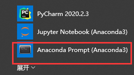
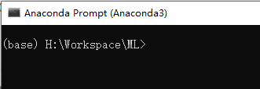
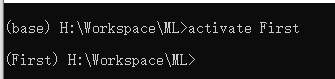
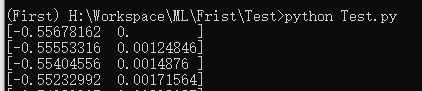
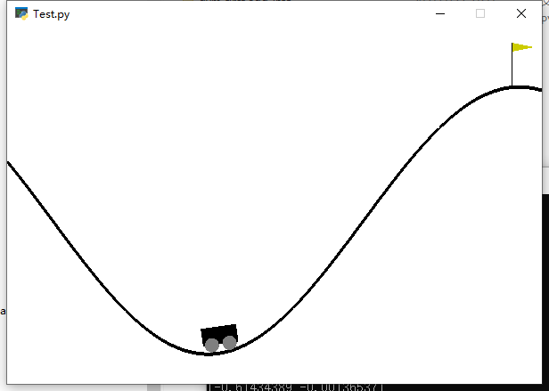

# TensorFlow + gym + Baselines 安装

1. 下载[Anaconda](https://www.anaconda.com/products/individual)

   Anaconda是一个开源的Python发行版本，它可以建立不同的Python运行时环境，例如用户A想运行在Python3.6下，而用户B想运行在3.8下，这时就可以通过Anaconda为A和B建立不用的运行时环境。

   

2. 打开Anaconda。在开始菜单中点击：

   

   自动打开命令行工具：



​	   前面的（base）就是当前Python运行的环境。


3. 建立我们需要的工作环境。

   ```sh
   # 创建了一个名为Frist的工作环境，它运行在3.8下, 运行后会在Anaconda的安装目录下的envs中创建一个First目录，用来保存工作环境的相关包
   conda create -n Frist python=3.8 --yes 
   # 激活工作环境
   activate Frist
   ```

   可以看到已经切换到Frist工作环境下：

   

4. 安装TensorFlow

   ```
   pip install tensorflow
   ```

   

5. 安装gym

   gym是一套开源工具包，可以用来定制我们自己的强化学习环境。我们先仿照[gym_soccer](https://github.com/openai/gym-soccer)配置好环境。把我们自己的环境命名为**gym-first**， 运行如下命令安装：

   ```
   cd gym-first
   pip install -e .
   ```

   测试gym。新建一个Python文件：

   ```python
   import gym
   env = gym.make('MountainCar-v0')
   for i_episode in range(20):
       observation = env.reset()
       for t in range(100):
           env.render()
           print(observation)
           action = env.action_space.sample()
           observation, reward, done, info = env.step(action)
       if done:
           print("Episode finished after {} timesteps".format(t+1))
           break
   env.close()
   ```

   在First环境下运行：

   

   可以看到一个小车在动：

   

6. 安装Baselines

   Baselines是一个强化学习的资源库，它实现的算法包括：A2C，ACER，PPO1，PPO2，TRPO等等，安装方式：

   ```sh
   git clone https://github.com/openai/baselines.git
   cd baselines
   pip install -e .
   ```

   

   
