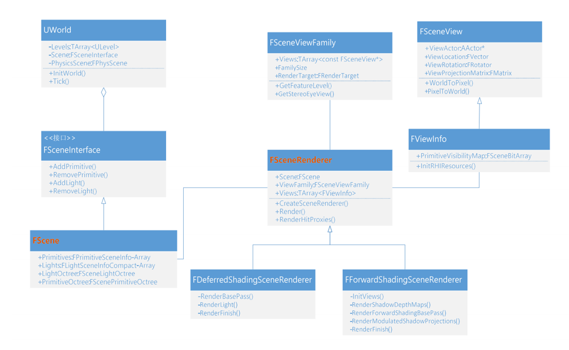
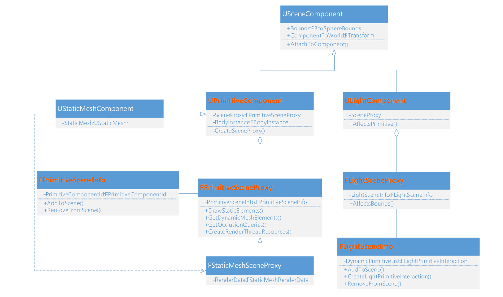

# UE4 渲染过程

[TOC]


## 相关类和概念







**FViewPort**: 就是一个RenderTarget, 引擎绘制画面的地方。

**FSceneView**: 管理着摄像机相关的一些数据，例如从哪里看，看的方向，视角大小等。可以看作是对模型空间的屏幕空间映射的管理。

**FSceneViewFamily**: 管理着一堆的FSceneView, 通常只有一个，如果有分屏，就有多个。

**FViewInfo**: FSceneView的子类，多了一些例如渲染状态的数据。


### 创建渲染器

调用堆栈

```
FSceneRenderer::CreateSceneRenderer
-> FRendererModule::BeginRenderingViewFamily
-> UGameViewPortClient::Draw  //创建ViewFamily
-> FViewPort::Draw
```

`CreateSceneRenderer`根据当前的ShadingPath创建渲染器。

### 渲染入口

```
FSceneRenderer::Render
-> RenderViewFamily_RenderThread
-> FRendererModule::BeginRenderingViewFamily 提交到渲染线程
```


## StaticMesh绘制初始化

### 收集StaticMesh

SPDI(StaticPrimitiveDrawInterface) 这是一个用来存储Mesh相关绘制数据的一个类。会填充FPrimitiveSceneInfo中的**StaticMeshes**和**StaticMeshRelevances**字段。

游戏启动后，游戏线程创建了各种Actor， 然后提交到渲染线程，在第一次Render调用时，UpdateAllPrimitiveSceneInfos检查到有新增了Actor, 使用FBatchingSPDI填充绘制相关数据，以StaticMeshComponent为例，调用堆栈：

```cpp
FBatchingSPDI::DrawMesh
-> FStaticMeshSceneProxy::DrawStaticElements
-> FPrimitiveSceneInfo::AddStaticMeshes
-> FPrimitiveSceneInfo::AddToScene
-> FScene::UpdateAllPrimitiveSceneInfos
```

使用FBatchingSPDI收集Primitive的StaticMesh, 存在**FPrimitiveSceneInfo::StaticMeshes**中

将场景中的所有StaticMesh收集到**FScene::StaticMeshes**中，Primitive中的StaticMesh中存有**FScene::StaticMeshes**的下标作为索引。


### 缓存DrawCommand

收集完成之后，在`AddStaticMeshes`函数末尾， 调用`CacheMeshDrawCommands`函数缓存StaticMesh的DrawCommand。在`CacheMeshDrawCommands`中，会创建很多个`FMeshPassProcessor`, 使用这些Processor来创建DrawCommand:

```cpp
for (int32 PassIndex = 0; PassIndex < EMeshPass::Num; PassIndex++)
{
    ...
    PassProcessorCreateFunction CreateFunction = FPassProcessorManager::GetCreateFunction(ShadingPath, PassType);
	FMeshPassProcessor* PassMeshProcessor = CreateFunction(Scene, nullptr, &CachedPassMeshDrawListContext);
    ...
    PassMeshProcessor->AddMeshBatch(Mesh, BatchElementMask, SceneInfo->Proxy);
	...
}
```

以DepthPass为例，创建的堆栈为：

```
FMeshPassProcessor::BuildMeshDrawCommands
-> FDepthPassMeshProcessor::Process
-> FDepthPassMeshProcessor::AddMeshBatch
-> FPrimitiveSceneInfo::CacheMeshDrawCommands
```

Build完成后，会在`FCachedPassMeshDrawListContext::FinalizeCommand`中存储DrawCommand：

```cpp
void FCachedPassMeshDrawListContext::FinalizeCommand(...)
{
    ...
    auto hash = CachedMeshDrawCommandStateBuckets.ComputeHash(MeshDrawCommand);
    ...
    SetId = CachedMeshDrawCommandStateBuckets.FindOrAddIdByHash(hash, MeshDrawCommand, FMeshDrawCommandCount());
    ...
}
```

几个概念：

FStaticMeshBatchRelevance     SceneInfo->StaticMeshRelevances

FCachedMeshDrawCommandInfo   SceneInfo->StaticMeshCommandInfos

### 疑问

1. 启动游戏时，在UpdateAllPrimitiveSceneInfos缓存了一遍DrawCommand，在之后的`FSceneRender::ComputeViewVisibilty`中，又调用`FPrimitiveSceneInfo::UpdateStaticMeshes`缓存了DrawCommand，这样做是否重复？


## 数据更新

当游戏侧有数据更新时，都会保存到FScene中，以备下一帧的渲染。

### 新增Actor

```
FScene::AddedPrimitiveSceneInfos.Add
-> FScene::AddPrimitiveSceneInfo_RenderThread
-> FScene::AddPrimitive   //提交到渲染线程
-> UPrimitiveComponent::CreateRenderState_Concurrent
-> UActorComponent::ExecuteRegisterEvents
-> UActorComponent::RegisterComponentWithWorld
-> AActor::IncrementalRegisterComponents
-> AActor::RegisterAllComponents
-> AActor::PostSpawnInitialize
-> UWorld::SpawnActor

```

### 删除Actor

```
//从FScene::AddedPrimitiveSceneInfos减掉 或  添加到FScene::RemovedPrimitiveSceneInfos
FScene::RemovePrimitiveSceneInfo_RenderThread
-> FScene::RemovePrimitive //提交到渲染线程
-> UPrimitiveComponent::DestroyRenderState_Concurrent
-> UActorComponent::ExecuteUnregisterEvents
-> UActorComponent::UnregisterComponent
-> AActor::UnregisterAllComponents
-> UWorld::DestroyActor
```

### Transform更新

```
FScene::UpdatedTransforms.Add
-> FScene::UpdatePrimitiveTransform_RenderThread
-> FScene::UpdatePrimitiveTransform   //提交到渲染线程
-> UPrimitiveComponent::SendRenderTransform_Concurrent
-> UActorComponent::DoDeferredRenderUpdates_Concurrent
-> UWorld::SendAllEndOfFrameUpdates
```
#### 静态物体

一般是通过接口设置物体移动
```
UWorld::MarkActorComponentForNeededEndOfFrameUpdate
-> UActorComponent::MarkForNeededEndOfFrameUpdate
-> UActorComponent::MarkRenderTransformDirty
-> USceneComponent::PropagateTransformUpdate
-> USceneComponent::UpdateComponentToWorldWithParent
-> USceneComponent::InternalSetWorldLocationAndRotation
-> UPrimitiveComponent::MoveComponentImpl
-> AActor::SetActorLocation
```

#### 动态物体

一般是本组件处理移动
```
//LevelTick.cpp   UWorld
ComponentsThatNeedEndOfFrameUpdate_OnGameThread.Add(Component)
-> UWorld::MarkActorComponentForNeededEndOfFrameUpdate
-> UActorComponent::MarkForNeededEndOfFrameUpdate
-> UActorComponent::MarkRenderDynamicDataDirty
-> USkeletalMeshComponent::FinalizeAnimationUpdate
-> USkeletalMeshComponent::PostAnimEvaluation
-> USkeletalMeshComponent::RefreshBoneTransforms
-> USkinnedMeshComponent::TickComponent
-> USkeletalMeshComponent::TickComponent
```

## 剔除

### 距离剔除

```cpp
//SceneVisibility.cpp
bool FViewInfo::IsDistanceCulled_AnyThread
```

调用堆栈

```
FViewInfo::IsDistanceCulled_AnyThread
-> FProjectedShadowInfo::AddSubjectPrimitive_AnyThread
-> FGatherShadowPrimitivesPacket::FilterPrimitiveForShadows
-> FGatherShadowPrimitivesPacket::AnyThreadTask
-> FSceneRenderer::GatherShadowPrimitives
-> FSceneRenderer::InitDynamicShadows
-> FDeferredShadingSceneRenderer::InitViewsPossiblyAfterPrepass
-> FDeferredShadingSceneRenderer::InitViews
```


### 视锥体剔除

```cpp
//SceneVisibility.cpp
static int32 FrustumCull(const FScene* Scene, FViewInfo& View)
```
调用堆栈：

```cpp
FrustumCull
-> FSceneRenderer::ComputeViewVisibility
-> FDeferredShadingSceneRenderer::InitViews
-> FDeferredShadingSceneRenderer::Render
-> RenderViewFamily_RenderThread
```

### 遮挡剔除

```cpp
//SceneVisibility.cpp
static int32 OcclusionCull(...)
```
调用堆栈
```
OcclusionCull
-> FSceneRenderer::ComputeViewVisibility
-> FDeferredShadingSceneRenderer::InitViews
-> FDeferredShadingSceneRenderer::Render
-> RenderViewFamily_RenderThread
```

## 分类

分类使用`FRelevancePacket`类来封装：

```cpp
struct FRelevancePacket
{
    ...
	FRelevancePrimSet<int32> Input; //输入，为Index
	FRelevancePrimSet<int32> RelevantStaticPrimitives; //静态队列
	FRelevancePrimSet<int32> NotDrawRelevant; //隐藏队列
	FRelevancePrimSet<int32> TranslucentSelfShadowPrimitives; //半透明队列
    ...
    void ComputeRelevance(); //计算输入的的Primitive, 加入不同的队列中
    void MarkRelevant(); //主要对StaticMesh做处理
    ...
}
```

调用堆栈:
```
ComputeRelevance
-> FRelevancePacket::AnyThreadTask
-> ComputeAndMarkRelevanceForViewParallel
-> FSceneRenderer::ComputeViewVisibility
-> FDeferredShadingSceneRenderer::InitViews
-> FDeferredShadingSceneRenderer::Render
-> RenderViewFamily_RenderThread
```

### 静态物体

缓存DrawCommand

```
FPrimitiveSceneInfo::CacheMeshDrawCommands
-> FPrimitiveSceneInfo::AddStaticMeshes
-> FPrimitiveSceneInfo::AddToScene
-> FScene::UpdateAllPrimitiveSceneInfos
-> FDeferredShadingSceneRenderer::Render
```

如果是静态物体，会在`MarkRelevant`中处理：

```cpp
void MarkRelevant()
{
	...
	for (int32 StaticPrimIndex = 0, Num = RelevantStaticPrimitives.NumPrims; StaticPrimIndex < Num; ++StaticPrimIndex)
	{
        ...
        DrawCommandPacket.AddCommandsForMesh(...)
        ...
    }
    ...
}
```

AddCommandsForMesh的目的主要是将缓存的DrawCommand拷到一个`VisibleCachedDrawCommands`的列表里面：

```cpp
void AddCommandsForMesh(...)
{
    if (bUseCachedMeshCommand)
	{
        //从CachedMeshDrawCommandStateBuckets找到对应的DrawCommand
        ...
        //在VisibleCachedDrawCommands列表里新建一个元素NewVisibleMeshDrawCommand
        VisibleCachedDrawCommands[(uint32)PassType].AddUninitialized();
	    FVisibleMeshDrawCommand& NewVisibleMeshDrawCommand = VisibleCachedDrawCommands[(uint32)PassType].Last();
        ...
        //将DrawCommand存到NewVisibleMeshDrawCommand里
        NewVisibleMeshDrawCommand.Setup(...)
    }
    else
    {
        NumDynamicBuildRequestElements[PassType] += StaticMeshRelevance.NumElements;
		DynamicBuildRequests[PassType].Add(&StaticMesh);
    }
}
```

之后，在`FRelevancePacket.RenderThreadFinalize `函数中，将分类获得的信息拷出去。

### 动态物体

收集DynamicMesh, `FSceneRenderer::ComputeViewVisibility`中：

```cpp
SCOPED_NAMED_EVENT(FSceneRenderer_GatherDynamicMeshElements, FColor::Yellow);
// Gather FMeshBatches from scene proxies
GatherDynamicMeshElements(...);
```

生成DrawCommand

```
GenerateDynamicMeshDrawCommands
-> FMeshDrawCommandPassSetupTask::AnyThreadTask
-> FParallelMeshDrawCommandPass::DispatchPassSetup
-> FSceneRenderer::SetupMeshPass
-> FSceneRenderer::ComputeViewVisibility
-> FDeferredShadingSceneRenderer::InitViews
-> FDeferredShadingSceneRenderer::Render
-> RenderViewFamily_RenderThread
```


## MeshPass

在`InitViews`最后，调用了`SetupMeshPass`:

```cpp
void FSceneRenderer::SetupMeshPass()
{
    ...
    PassProcessorCreateFunction CreateFunction = FPassProcessorManager::GetCreateFunction(ShadingPath, PassType);
	FMeshPassProcessor* MeshPassProcessor = CreateFunction(Scene, &View, nullptr);
    FParallelMeshDrawCommandPass& Pass = View.ParallelMeshDrawCommandPasses[PassIndex];
	...
	Pass.DispatchPassSetup(...)
   ...
}
```

`FMeshPassProcessor`是一个将`FMeshBatch`转化为`FMeshDrawCommands`的一个工具。


FMeshPassProcessor::BuildMeshDrawCommands

FCachedPassMeshDrawListContext::FinalizeCommand


## 绘制

以PrePass为例，堆栈为：

```
FMeshDrawCommand::SubmitDraw
-> SubmitMeshDrawCommandsRange  //MeshPassProcessor.cpp
-> FParallelMeshDrawCommandPass::DispatchDraw
-> FDeferredShadingSceneRenderer::RenderPrePassView
-> FDeferredShadingSceneRenderer::RenderPrePass
-> FDeferredShadingSceneRenderer::Render
```

